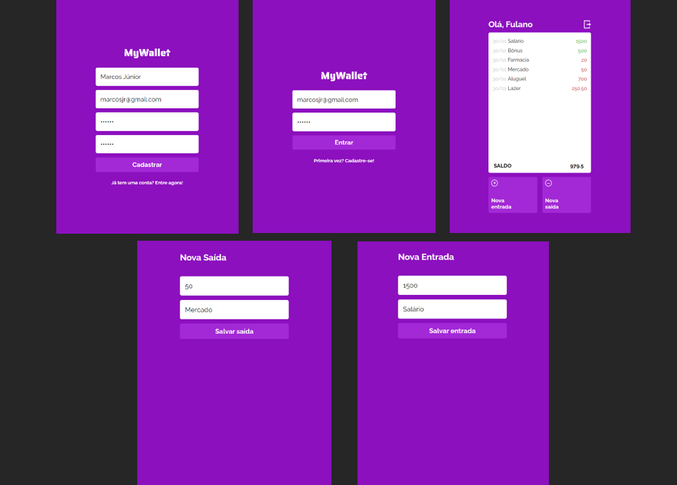

# My Wallet

An easy to use financial manager. Track your revenues and expenses to learn how you spend your money and know how much you have.



Try it out clicking [here](https://my-wallet-frontend-rose.vercel.app/)!

## About

This is an web application with which lots of people can manage their own expenses and revenues. Below are the implemented features:

- Sign Up
- Login
- List all financial events for a user
- Add expense
- Add revenue

By using this app any user can learn how they've been using their money and always keep track of your balance.

## Technologies
The following tools and frameworks were used in the construction of the project:<br>
<p>
  
  
  
  
</p>

## How to run

1. Clone this repository
2. Clone the back-end repository at https://github.com/mmagalhaesjr/my-wallet-backend
3. Follow instructions to run back-end at https://github.com/mmagalhaesjr/my-wallet-backend
4. Install dependencies
```bash
npm install
```
5. Create a .env file at the root of the project following the .env.example, and set the environment variable REACT_APP_API_URL according to the port on which the backend is running on your computer. Example:
```bash
REACT_APP_API_URL=//localhost:5000
```
6. Run the front-end with
```bash
npm start
```
6. You can optionally build the project running
```bash
npm run build
```
