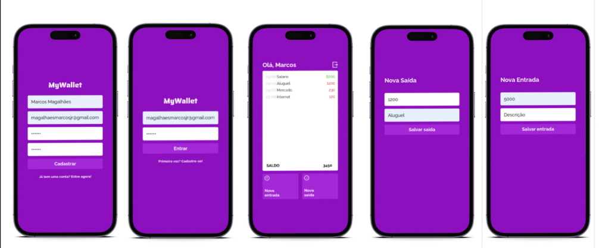

# My Wallet

###### [Read this page in English](README-en.md)

Um gerenciador financeiro super fácil de usar, onde o usuário pode acompanhar suas receitas e despesas para saber como tem gastado seu dinheiro e qual seu saldoa atual.



Experimente clicando [aqui](https://my-wallet-frontend-rose.vercel.app/)!

## Sobre

Este é um aplicativo onde os usuários podem gerenciar suas próprias despesas e receitas. Abaixo estão as funcionalidades implementadas:

- Cadastro
- Login
- Listagem de todas a transações financeiras do usuário
- Adicionar nova receita
- Adicionar nova despesa

Com este aplicativo, o usuário pode analisar como tem utilizado seu dinheiro e acompanhar seu saldo.

## Tecnologias
As seguintes ferramentas foram usados na construção do projeto:<br>
<p>
  
  
  
  
</p>

## Como executar

1. Clone o repositório do backend em https://github.com/mmagalhaesjr/my-wallet-backend e siga as instruções para executá-lo
2. Clone este repositório
3. Instale as dependências
```bash
npm install
```
4. Crie um arquivo .env na raiz do projeto seguindo o exemplo do .env.example e defina a variável de ambiente REACT_APP_API_URL de acordo com a porta em que o backend está sendo executado em seu computador. Exemplo:
```bash
REACT_APP_API_URL=//localhost:5000
```
6. Execute o fron-tend com o comando
```bash
npm start
```
